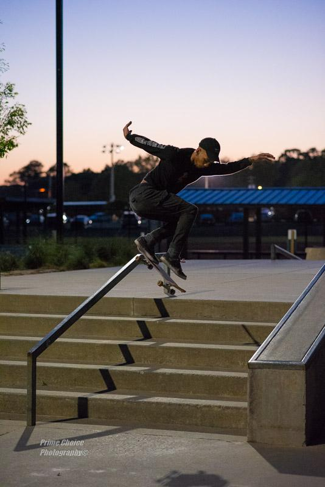
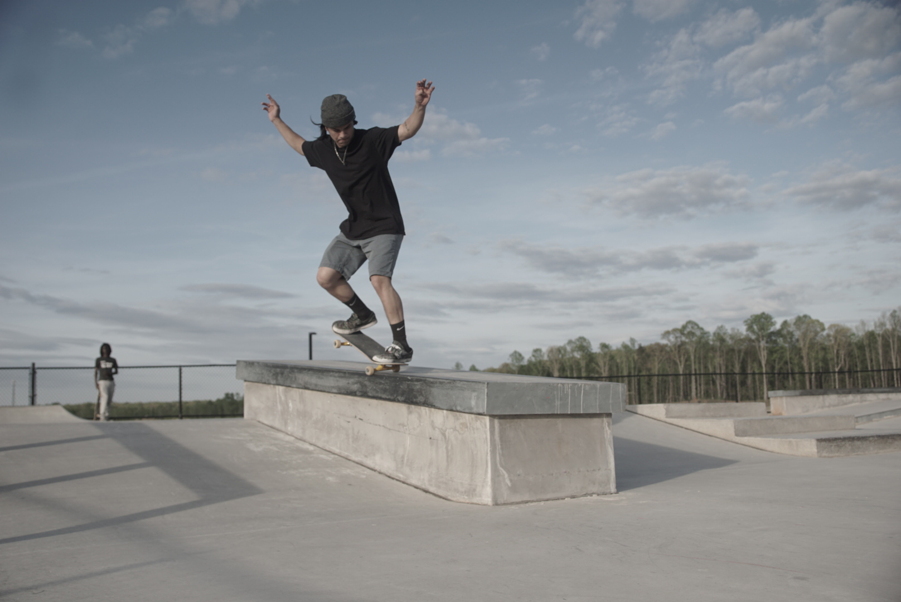
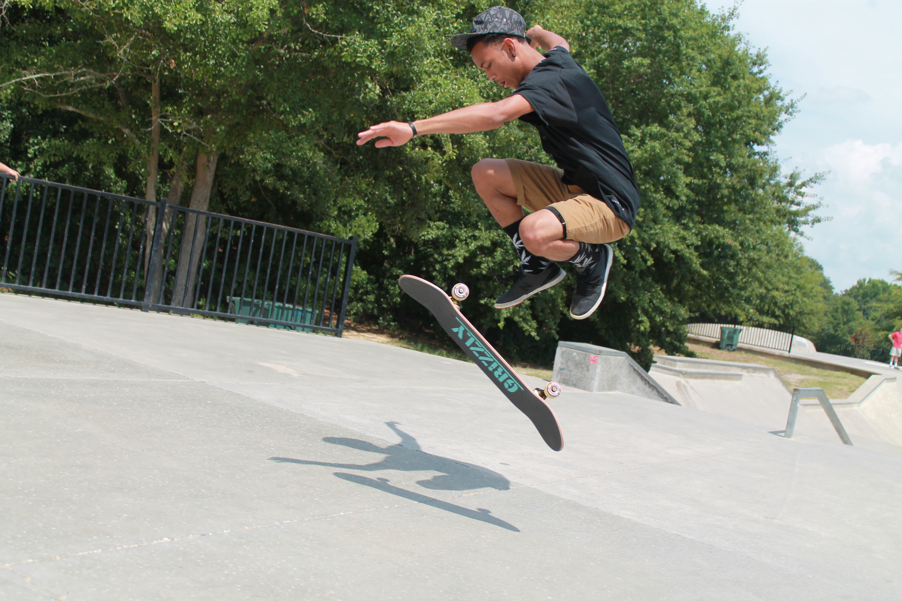

# SkateHub
* Our app "SkateHub," is an app that will connect skaters all over the world in the future. For this capstone project we will be focusing more on a smaller audience for the time being.

[About Page](./about.html)

[Screenshots](./screenshots.md)

**CLICK THE IMAGE BELOW FOR A DEMONSTRATION OF OUR APP SKATEHUB!**

[](https://www.youtube.com/watch?v=yc0-_V140U8)

<br><br><br><br>


<br><br><br><br>
* The app itself will let skaters create a profile in which they can enter basic information about themselves, add friends, find skate spots in their area, and socialize, as well as interact with other local skaters in their area. 

<br><br><br><br>


<br><br><br><br>
* This app will allow users to post these spots with a coordinate location for others to travel to. Users will be able to see what spots their friends are skating and invite their friends to come skate that spot. We wish to bring this to both IOS and Android devices by using the open-source Ionic Framework.

<br><br><br><br>


<br><br>
* Skateboarders don't have a set spot they skate, part of the skateboarding world is to venture out and find hidden spots.

<br><br>


<br><br>

```
Created by: Derwin Graham, William (Alex) Wood, TJ Bach, Chris Welborn, and Darius Brown
```
